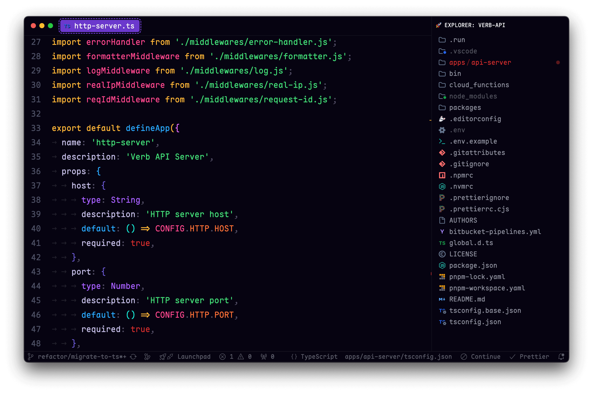

# Preview



# Description

This is my vscode config to make interface looks minimalistic. It should work fine with other themes but not guaranteed.

# Requirements

- [Apc Cusmoize UI++](https://marketplace.visualstudio.com/items?itemName=drcika.apc-extension)
- [VSCode Animations](https://marketplace.visualstudio.com/items?itemName=BrandonKirbyson.vscode-animations)
- [Symbols Icons](https://marketplace.visualstudio.com/items?itemName=miguelsolorio.symbols)
- [PurpleSchool Theme](https://marketplace.visualstudio.com/items?itemName=PurpleSchool.purpleschool-theme)
- [Dank Mono Font](https://philpl.gumroad.com/l/dank-mono)

# Installation

1. Copy-paste content from [vscode-settings.json](vscode-settings.json) into user settings.
2. Save [vscode-styles.css](vscode-styles.css) into {userHome}/Documents/vscode-styles.css or whatever you want, but do not forget to adjust a `apc.imports` path.

# Configurations

You can adjust few things via css variables:

```
// Window transparency amount
--al-transparency-percent: 25%;

// Split line color
--al-pane-split-color: rgb(255, 255, 255);
--al-pane-split-transparent: 2.5%;

// Label name
--al-label-name-shadow: 0px 2px 4px rgba(0, 0, 0, 0.15);

// Most wanted feature 🤣
--al-tab-height: 38px;
--al-tab-y-offset: 7px;

--al-tab-activeBackground: white;
--al-tab-activeColor: black;
--al-tab-fontSize: 14px;
--al-tab-borderRadius: 4px;
```
